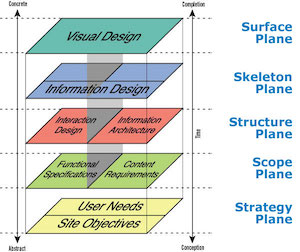
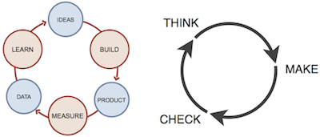
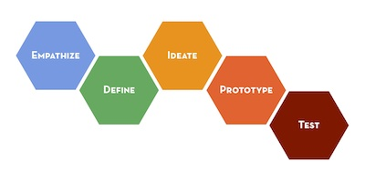

# UX Bootcamp
August 13, 2014

Thomas Wendt

---

#### Thomas Wendt, Design Strategist and Researcher
* thomas@srsg.co
* @thomas_wendt 

#### Agenda

| Time  | Topic  |
|---|---|
| 10:00-11:00  | [UX Foundations](#ux-foundations)  |
| 11:00-12:00  |  [User Research](#user-research) |
| 12:00-12.15  |  Break |
| 12.15-1:00  |  Usability and User Testing |
| 1:00-2:00  |  Lunch |
| 2:00-3:00  |  Information Architecture |
| 3:00-3.30  |  Sketching |
| 3.30-3.45 |  Break |
| 3.45-4.45  |  Wireframing and Prototyping |
| 4.45-5:00  | Wrap Up | 

### <a name="us-foundations">UX Foundations</a>

* Make an Affinity Map
	* Reorganizing ideas into groups so you can see where ideas are
* Definitions
	* Experience Design - How screens are interacting with each other or how flows are interacting with each other
		* Mapping out experiences and all decision points on the way there
		* Making the internet easier to use for regular people. A lot of experience design was born out of how the web looked in the mid to late 90s, where websites weren't architected well. 
* Everyday UX
	* When you have a flight cancelled, think about your entire experience from board, to flight attendants to gate attendants, etc. After you plane was cancelled, did the airline book a hotel room for you or upgrade you to first class or do nothing? 
		* Someone made a decision at some point and said if we have an "act of god" we do nothing. This has a strong effect on the user. 
* Jesse James Garrett
	* One of the first people to start talking about UX Design
	> "UX is the design of anything independent of medium or across media, with human experience as an explicit outcome and human engagement as an explicit goal."
	* Human aspect is at heart of UX Design
	* UX Design can be completely independent of medium, doesn't have to be tied to websites or apps. 
	* Elements of User Experience Graph
	
		
		
* Experiential Disciplines
	* Psychology
	* Sociology
	* Anthropology
		* Cultural influences
	* Philosopy
		* Study of human experience. How do we actually experience things
* UX vs UI
	* There is confusion between experience design and interface design. 
	* **Interface design** is literally designing the interface in front of you.
	* **Experience design** is more hazy - it's designing the experience around the interface. 
* Deliverables != The Entirety of UX
	* Even though this is one of the only tangibles things UX creates, there is a lot more to it
* Science vs Design
	* Science
		* Truth-driven
		* Inductive
		* Logical
		* Convergent
	* Design
		* Solution-driven
		* Abductive
		* Creation
		* Divergent
	* Types of Reasoning
		* Deduction
			* what we know to be absolutely true
		* Inductive 
			* where science or work of detective comes in. gather evidence and given what we know, figure out what is most likely
			* What we believe to be true based on what we know
		* Abduction
			* Where design comes in. Based on what we know, these are the possibilities for what could be. 
			* While the first two deal with the knowledge we have know, abduction mean based on what we know now what could be. It's always looking forward. 
* Best Practices
	* They are very rare
	* They only work in certain controlled situations
	* Don't rely on them
	
---

### Process

* 5 D's - Waterfall Process
	* Steps
		* Discover
		* Define
		* Design
		* Develop
		* Deliver
	* Discovery
		* Do user research
		* What are user problems
		* Deliverables:
			* Personas
				* An archetype of groups of users. Once you do a bunch of user research, interviews or studies, you collect a lot of findings. 
			* User Scenarios
	* Define
		* create the Interaction Model
		* Define the Content & Functionality Requirements, Information Architecture
		* Come up with Project Plan along with milestones and deliverables
		* Deliverables
			* Product Requirement Document
				* Similar to user stories
				* Documenting product requirements
	* Design
		* All ideas are put into paper sketches and go through a usability evaluation. 
		* Sketches transformed into wireframes and shown to clients
		* Once approved, proceed with creating mockups/UI designs
		* Deliverables
			* Sitemap
			* User flows
				* Flow diagrams - map out all decision points that a user would have to make to interact with a particular product. From the first time they sign in until the end. 
				* Allows you to take a very birds eye view of the product and zoom into certain areas.
			* Wireframes	
				* A blueprint for a screen
			* Specifications (mobile)
				* Wireframe for mobile with arrows pointing to descriptions
			* UI Designs
		* Development
			* Coding
		* Deployment
			* Usability Testing
			* Major issues corrected and other observations captured for next release
			* Deliverables
				* Usability Test Report
* Lean UX (Alternative to Waterfall)
	* Somewhat popular since 2010/2011. 
	* Based on lean manufacturing motives from Toyota
		* Cut as much waste as possible from manufacturing
	* Applied to UX, takes a practical approach
		* Focuses on 3 stages: build, measure and learn
		
		
* Agile UX (another alternative)
	* In itself it's a software methodology, a way for developers to work
	* Takes the waterfall process and chunks it up into smaller pieces
	* Devs work in sprints instead of working on the entire dev phase of the project
		* Built features, test them, then move on
		
		
* Design Thinking
	* Rich background in academia and business
	* Emphasizes finding a problem, coming up with solutions, then test if solutions are appropriate
	
	
	
---
	
### <a name="user-research">User Research</a>

* Why do it?
	* Ensures you're solving a problem that exists in people's lives
		* Yo app is an example of a product that isn't solving any problem
	* Key to building a product that is tailored to its audience
		> If you're building a product for everyone, you're really building it for no one.
		
		* Even Facebook has features built to cater to specific groups of users
		* Focus on nuanced groups of people
	* Ensure that your product solution aligns to analogous behaviors
* Components
	* Reasons for Research
		* Exploratory
			* Find out what the landscape looks like, what people's day-to-day lives look like
		* Validating
			* We're already building something and want to gut-check that it's the most appropriate solution
	* What Research Helps Answer
		* Why
			* Why does a problem exist
			* What isn't being people within the environment
		* What
			* What are behavioral patters
			* What motivates them to do what they do
			* What do they think about
			* What are their needs and frustrations
			* What are their habits and what do their routines look like
				* What is the difference between what they say they do and what they actually do 
		* When
		* Who
		* Where
		* How
			* How are people dealing with problems you've already identified
			* Do solutions already exist or are they hacking their own solutions together
				* if the latter it says a lot to the things we can design
* How do we get this information (Types of UX Research)
	* **Ethnography**
		* What is it?
			* Literally means 'writing culture'
				* Insert yourself into different communities or user bases
			* Being there
			* Deep hanging out
			* Observation
		* Pros v Cons
			* Pros
				* The most rich research method we have 
				* Allows for very deep insight into behavior
			* Cons
				* Can sometimes be costly
	* **Surveys**
		* What is it?
			* Allow for gathering a quantifiable information from a large number of people
				* Bad at finding what motivates people
			* Most are completed online through tools like Survey Monkey
		* Pros v Cons
			* Pros
				* Gather large numbers of responses very quickly
				* Get quantitative feedback immediately
			* Cons
				* Hard to get rich responses
				* Often learn about problems but not why they occur
				* Hard to write surveys
				* Subject to many cognitive biases
	* **Interviews**
		* What is it?
			* One-on-one discussions with end users
			* focused on probing behaviors
		* Pros v Cons
			* Pros
				* One-on-one discussion
				* Can gather rich, targeted information
				* Flexible, can explored tangents or unexpected areas
			* Cons
				* Can be time consuming to organize, run and analyze
				* Subject to many cognitive biases
* Where to Find Participants
	* The hardest part is finding the right people
		* important to get right users, not just anyone off the street
	* Where to find them:
		* anywhere you believe your users spend time
			* Coffee shops
				* tell them you're a student because people like talking to students - less off-putting, not selling something, etc.
			* Social networks and forums
			* Craigslist ads
				* Create a screener survey on survey monkey to weed out people you don't want to talk to: ask age, etc. Get $25 for an hour of time
			* Recruiters
* How to Ask Questions
	* Be wary of priming
	* Don't ask leading questions
	* Never ask about intention, always probe behavior
		* Bad Question - "How many times do you plan to go to the gym?"
		* Good Question - "How many times have you been to the gym in the last 3 months"
	* Focus on specific instances
		* Have you ever had _____ problem?
		* Tell about the last time you...?
	* Avoid generalizations and speculations
		* What do you usually...?
		* What do you intend to...?
	* Keep people talking
		* Tell me more about hat
		* What do you mean by...
		* Help me understand better..
	* Embrace awkward silences
		* Often the best insights come up when participants feel the need to fill silent voids
		* one of the best skills you can have as an interviewer is learning how to *shut up*
* Interview Prep
	* Record if possible
		* Always ask permission
		* Explain why and that it's for private use
	* Focus on topics rather than list of questions
		* Should be a conversation
	* If you divert off topic: "That's really interesting. Can you tell me how that connects to..."
* During the Interview
	* Start off with small talk, even if you hate it
	* Take notes but remain focused on participant. 